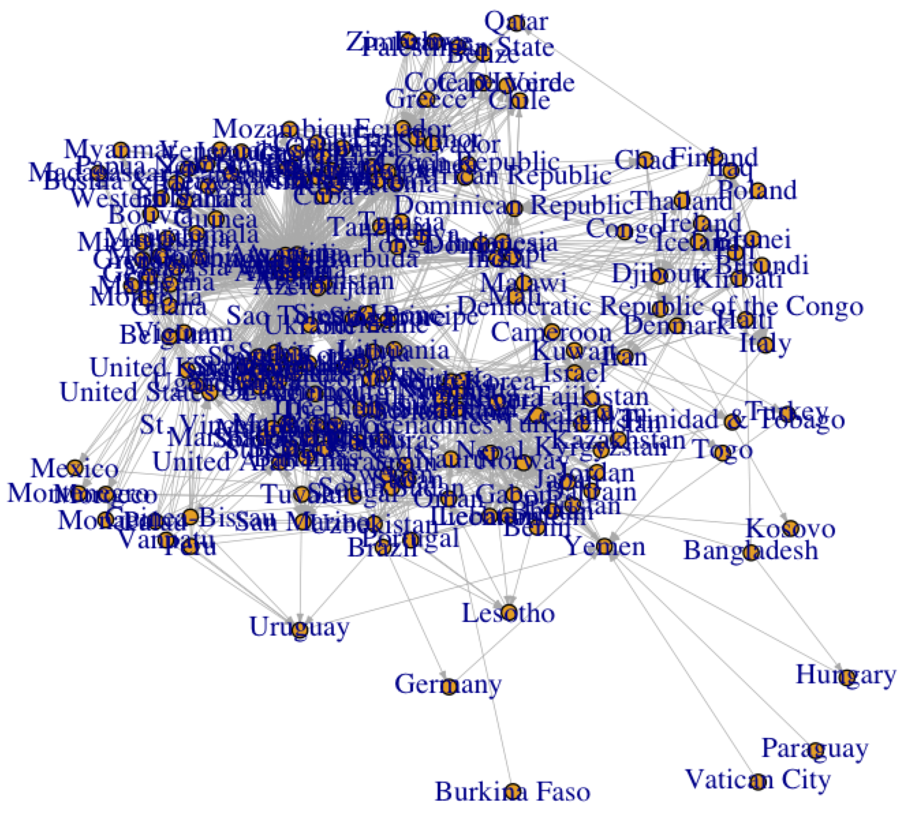
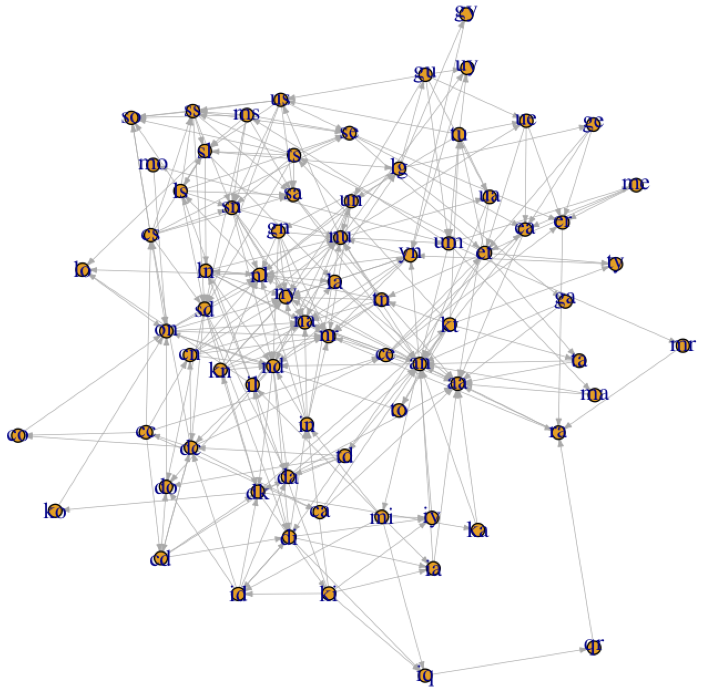

# around the world with start and end letters

Saw this tweet:

So I thought this was an interesting problem in general: "how can you get from one country name back to itself, where movement is allowed if the first letter of the next country is the same as the last letter of the current country?" So then I thought: how can I get the computer to do this for all countries?

First I took the list of countries [available from Darius Kazemi's `corpora` repository](https://github.com/dariusk/corpora/blob/master/data/geography/countries.json) (these are Anglicised and there are obvious problems with how we define a country, but for the sake of this exercise we'll just use them for now). 

We can load them into R using the `igraph` package (here's a [helpful page on using `igraph`](https://kateto.net/netscix2016.html)) and then use some [embarrassingly simple R code](TKTKTK URL) to find all the first letter to last letter connections.

Since it's a graph, I thought it would be nice to plot it at this stage? Well turns out that plotting graphs nicely is hard and it gets harder with the number of nodes (vertices) in the graph. So we end up with this nonsense:

Looking at this mess made me realise a few things:

1. we only care about start/end letters, so the graph can be simplified to just have vertices for unique start/end combinations (e.g., Australia and Algeria are both coded as "aa").
2. There are some places that only have 1 connection (in or out) so these cul-de-sacs can be pruned from the graph, as we can get back to them (or from them). For example in the above graph we see that Vatican City is such a cul-de-sac.

Applying these two rules we end up with a much simpler representation for the computer (we actually apply the second rule twice, since we end up creating new cul-de-sacs after the first run):

In case you were interested, the countries that don't work with this game are:

Bahamas, Barbados, Belarus, Bahrain, Benin, Bhutan, Bangladesh, Belgium, Belize, Bolivia, Bosnia & Herzegovina, Botswana, Bulgaria, Brazil, Brunei, Burundi, Burkina Faso, Fiji, Finland, France, Jamaica, Japan, Jordan, Pakistan, Palau, Peru, Palestinian State, Panama, Papua New Guinea, Paraguay, Poland, Portugal, Vanuatu, Vatican City, Venezuela, Vietnam, Western Sahara, Zambia, Zimbabwe, Haiti, Honduras, Hungary.

Bummer!

This simplification is good because it's easier to see what's going on and because we're about to use an algorithm to find the shortest paths and we'd like to run it as few times as possible. To find the shortest path, we'll use Dijkstra's algorithm, which you can [read more about here](https://en.wikipedia.org/wiki/Dijkstra%27s_algorithm) (Dijkstra shunned computers and [had his e-mails printed and hand-wrote replies to them](https://everything2.com/user/rp/writeups/Edsger+W.+Dijkstra)). Fortunately `igraph` has an implementation of the algorithm in its `shortest_paths` function, so we can just apply this for each vertex.

Finally, having done that, we can take the abstracted two letter codes and expand them out to the full set of countries. I've put them in a table below. Note that because there are multiple entries for each two letter code, we end up with multiple possible shortest paths below.

| Start/end |   |   |   |   |   |
|-----------|---|---|---|---|---|
| Afghanistan Azerbaijan | Namibia Nicaragua Nigeria North Korea North Macedonia |  |  |  |  |
| Albania Algeria Andorra Angola Antigua & Barbuda Argentina Armenia Australia Austria | Albania Algeria Andorra Angola Antigua & Barbuda Argentina Armenia Australia Austria |  |  |  |  |
| Cambodia Canada China Colombia Costa Rica Croatia Cuba | Afghanistan Azerbaijan | New Zealand | Dominican Republic |  |  |
| Cameroon | New Zealand | Dominican Republic |  |  |  |
| Cape Verde Chile Cote D'Ivoire | Egypt | Thailand | Dominican Republic |  |  |
| Central African Republic Czech Republic | Central African Republic Czech Republic |  |  |  |  |
| Chad | Dominican Republic |  |  |  |  |
| Comoros Cyprus | Swaziland Switzerland | Dominican Republic |  |  |  |
| Congo | Oman | New Zealand | Dominican Republic |  |  |
| Democratic Republic of the Congo | Oman | New Zealand |  |  |  |
| Denmark | Kazakhstan Kyrgyzstan | New Zealand |  |  |  |
| Djibouti | Iceland Ireland |  |  |  |  |
| Dominica | Afghanistan Azerbaijan | New Zealand |  |  |  |
| Dominican Republic | Chad |  |  |  |  |
| East Timor Ecuador El Salvador | Romania Russia Rwanda | Afghanistan Azerbaijan | Nauru | Ukraine |  |
| Egypt | The Netherlands The Philippines | Sao Tome & Principe Sierra Leone Singapore Suriname |  |  |  |
| Equatorial Guinea Eritrea Estonia Ethiopia | Afghanistan Azerbaijan | Nauru | Ukraine |  |  |
| Gabon | Nepal | Luxembourg |  |  |  |
| Gambia Georgia Ghana Grenada Guatemala Guinea Guyana | Afghanistan Azerbaijan | Nepal | Luxembourg |  |  |
| Germany | Yemen | Nepal | Luxembourg |  |  |
| Greece | Egypt | Taiwan Tajikistan Turkmenistan | Nepal | Luxembourg |  |
| Guinea-Bissau | United Arab Emirates | Senegal | Luxembourg |  |  |
| Iceland Ireland | Djibouti |  |  |  |  |
| India Indonesia | Afghanistan Azerbaijan | New Zealand | Djibouti |  |  |
| Iran | New Zealand | Djibouti |  |  |  |
| Iraq | Qatar | Romania Russia Rwanda | Afghanistan Azerbaijan | New Zealand | Djibouti |
| Israel | Laos | Swaziland Switzerland | Djibouti |  |  |
| Italy | Yemen | New Zealand | Djibouti |  |  |
| Kazakhstan Kyrgyzstan | New Zealand | Denmark |  |  |  |
| Kenya | Afghanistan Azerbaijan | New Zealand | Denmark |  |  |
| Kiribati | Iceland Ireland | Denmark |  |  |  |
| Kosovo | Oman | New Zealand | Denmark |  |  |
| Kuwait | Thailand | Denmark |  |  |  |
| Laos | Senegal |  |  |  |  |
| Latvia Liberia Libya Lithuania | Afghanistan Azerbaijan | Nepal |  |  |  |
| Lebanon Liechtenstein | Nepal |  |  |  |  |
| Lesotho | Oman | Nepal |  |  |  |
| Luxembourg | Gabon | Nepal |  |  |  |
| Madagascar Myanmar | Romania Russia Rwanda | Afghanistan Azerbaijan | Nauru | United Kingdom |  |
| Malawi Mali | Iran | Nauru | United Kingdom |  |  |
| Malaysia Malta Mauritania Micronesia Moldova Mongolia | Afghanistan Azerbaijan | Nauru | United Kingdom |  |  |
| Maldives Marshall Islands Mauritius | South Sudan Spain Sudan Sweden | Nauru | United Kingdom |  |  |
| Mexico Monaco Montenegro Morocco | Oman | Nauru | United Kingdom |  |  |
| Mozambique | Egypt | Tuvalu | United Kingdom |  |  |
| Namibia Nicaragua Nigeria North Korea North Macedonia | Afghanistan Azerbaijan |  |  |  |  |
| Nauru | Uzbekistan |  |  |  |  |
| Nepal | Lebanon Liechtenstein |  |  |  |  |
| New Zealand | Democratic Republic of the Congo | Oman |  |  |  |
| Niger | Romania Russia Rwanda | Afghanistan Azerbaijan |  |  |  |
| Norway | Yemen |  |  |  |  |
| Oman | Nepal | Lesotho |  |  |  |
| Qatar | Romania Russia Rwanda | Afghanistan Azerbaijan | New Zealand | Djibouti | Iraq |
| Romania Russia Rwanda | Afghanistan Azerbaijan | Niger |  |  |  |
| Samoa Saudi Arabia Serbia Slovakia Slovenia Somalia South Africa South Korea Sri Lanka St. Lucia Syria | Afghanistan Azerbaijan | Nepal | Laos |  |  |
| San Marino | Oman | Nepal | Laos |  |  |
| Sao Tome & Principe Sierra Leone Singapore Suriname | Egypt | The Netherlands The Philippines |  |  |  |
| Senegal | Laos |  |  |  |  |
| Seychelles Solomon Islands St. Kitts & Nevis St. Vincent & The Grenadines | Seychelles Solomon Islands St. Kitts & Nevis St. Vincent & The Grenadines |  |  |  |  |
| South Sudan Spain Sudan Sweden | Nauru | United Arab Emirates |  |  |  |
| Swaziland Switzerland | Dominican Republic | Comoros Cyprus |  |  |  |
| Taiwan Tajikistan Turkmenistan | Nauru | Ukraine | Egypt |  |  |
| Tanzania Tonga Tunisia | Afghanistan Azerbaijan | Nauru | Ukraine | Egypt |  |
| Thailand | Denmark | Kuwait |  |  |  |
| The Netherlands The Philippines | Sao Tome & Principe Sierra Leone Singapore Suriname | Egypt |  |  |  |
| Togo Trinidad & Tobago | Oman | Nauru | Ukraine | Egypt |  |
| Turkey | Yemen | Nauru | Ukraine | Egypt |  |
| Tuvalu | Ukraine | Egypt |  |  |  |
| Uganda United States Of America | Afghanistan Azerbaijan | Nauru |  |  |  |
| Ukraine | Egypt | Tuvalu |  |  |  |
| United Arab Emirates | South Sudan Spain Sudan Sweden | Nauru |  |  |  |
| United Kingdom | Malawi Mali | Iran | Nauru |  |  |
| Uruguay | Yemen | Nauru |  |  |  |
| Uzbekistan | Nauru |  |  |  |  |
| Yemen | Norway |  |  |  |  |

